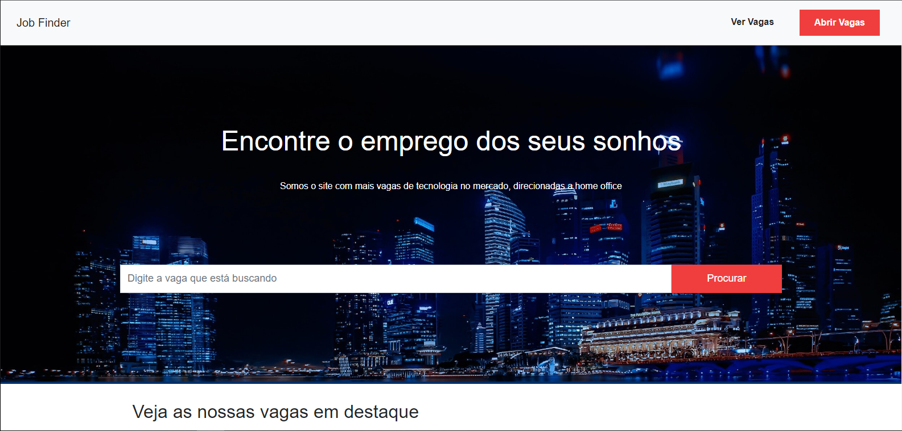
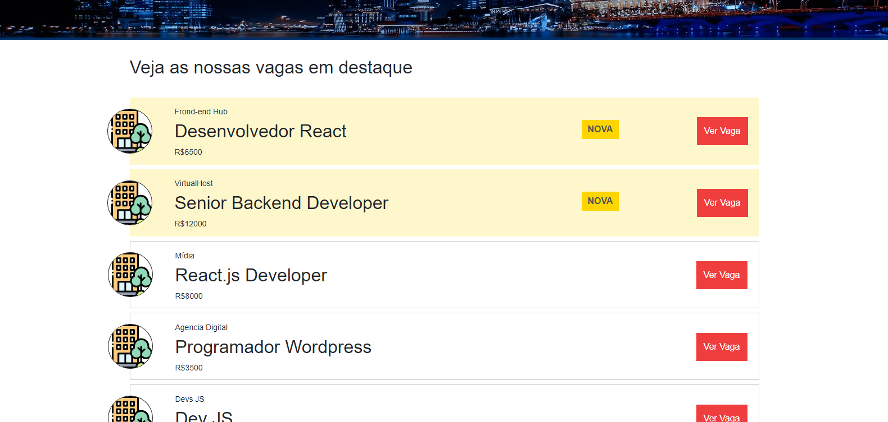
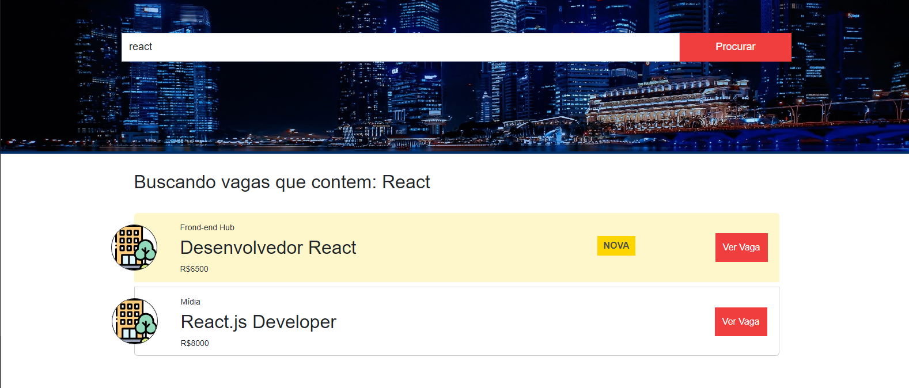
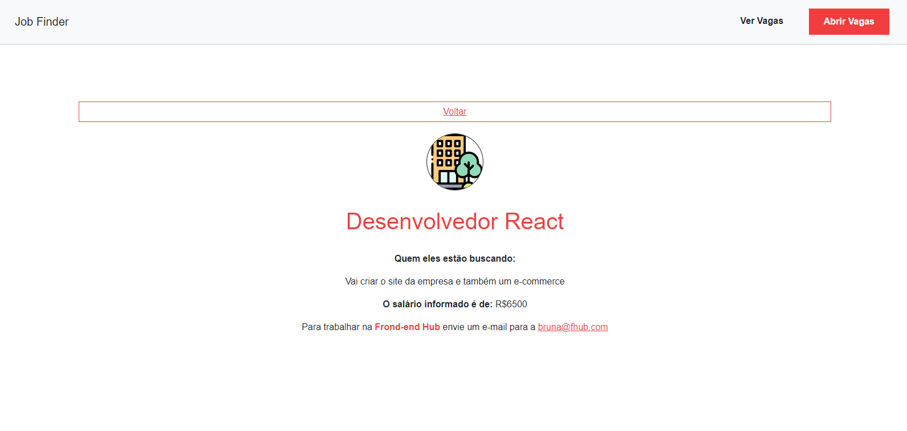
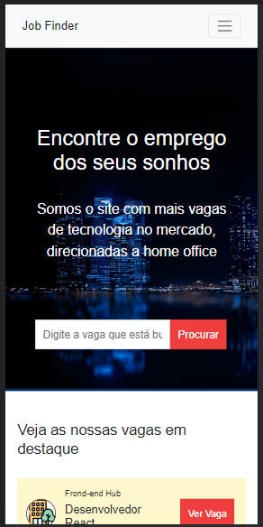
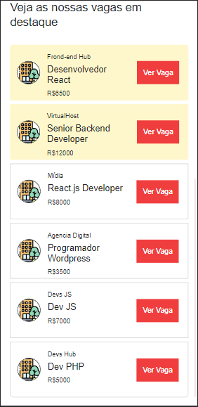

 job-finder
 
 ## :eyeglasses: Projeto

<!-- Mobile -->

 
  

 

## 📖 Sobre o Projeto
<b><i><u>'job-finder'.</b></i></u> Site responsivo para programadores encontrarem vagas de emprego.  

Projeto construído pelo curso JavaScript do básico ao avançado (c/ Node.js e projetos)](https://www.udemy.com/course/javascript-do-basico-ao-avancado-com-node-e-projetos/) seguindo as dicas do [Matheus Battisti](https://github.com/matheusbattisti/).

## :globe_with_meridians: Tecnologias
Este projeto foi construído com: 
  
 
 

## 📱 Contato

